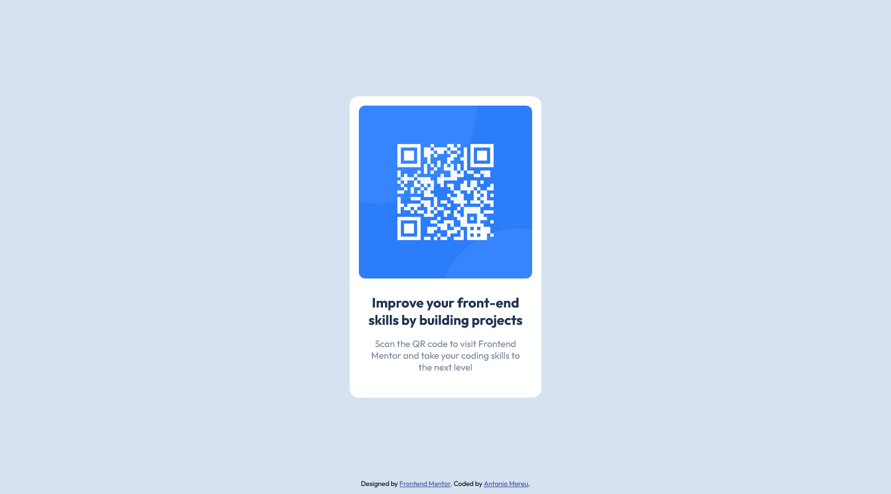
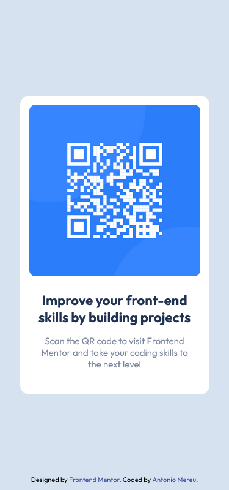

# Frontend Mentor - Order summary card solution

Thank you for checking out my solution to the [QR code component by Frontend Mentor](https://www.frontendmentor.io/challenges/order-summary-component-QlPmajDUj). Frontend Mentor challenges help you improve your coding skills by building realistic projects.

## Table of contents

- [Overview](#overview)
  - [The challenge](#the-challenge)
  - [Screenshot](#screenshot)
  - [Links](#links)
- [My process](#my-process)
  - [Built with](#built-with)
  - [Useful resources](#useful-resources)
- [Author](#author)

**Note: Delete this note and update the table of contents based on what sections you keep.**

## Overview

### The challenge

Users should be able to:

- See hover states for interactive elements

### Solution screenshots:

## Desktop

## Mobile

### Links

- [Solution URL](https://www.frontendmentor.io/solutions/css-flexbox-css-variables-google-fonts-XxXnfseesk)
- [Live website URL](https://antoniomereu.github.io/QR-code-component-Antonio-Mereu/)

## My process

### Built with

- Semantic HTML5 markup
- CSS custom properties
- Flexbox
- Mediaqueries

### Useful resources

- [Microsoft Power Toys](https://learn.microsoft.com/it-it/windows/powertoys/) - I use Microsoft Power Toys a lot. It includes a tool called Screen Ruler, which is incredibly useful for measuring designs if you don't have the design Adobe XD or Figma file. Additionally it offers a wide range of other handy features, such as Color Picker, Text Grab and a lot more. My favorite tool since you can use it on any program, unlike chrome or other browsers where you have to install a bunch of extensions.

## Author

- Frontend Mentor - [@AntonioMereu](https://www.frontendmentor.io/profile/AntonioMereu)
